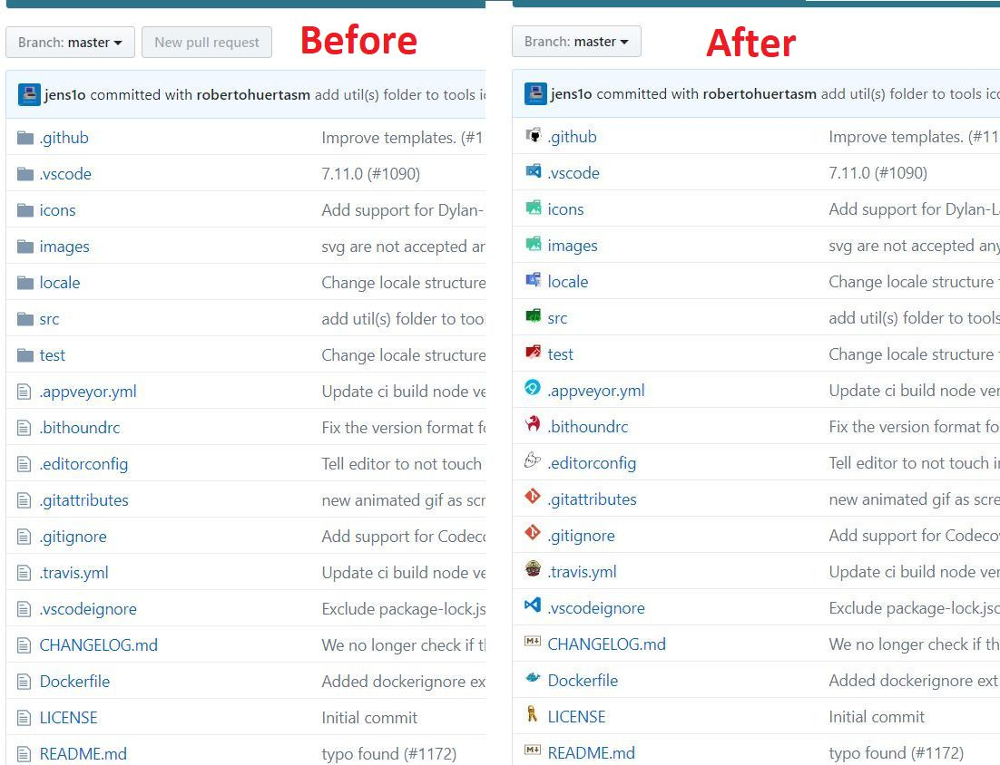
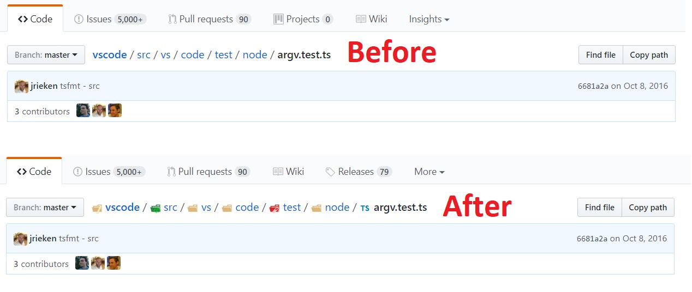

# Github-vscode-icons

**Chrome:** [Download extension from store](https://chrome.google.com/webstore/detail/vscode-github-icons/hoccpcefjcgnabbmojbfoflggkecmpgd?utm_source=github)

**Firefox:** *Not supported yet*

**Opera:** *WIP*

**Supported websites:** Github (also Gist), Gitlab, Bitbucket and Pastebin

## About

Extension for browser, which displays [vscode-icons](https://github.com/vscode-icons/vscode-icons) in github, gitlab and bitbucket repositories. It also displays `vscode-icons` in user's pastebin list.

If you're familiar with beautiful extension for vscode called `vscode-icons`, then you know that you need also one for Web. Brain will recognize different
icons much faster and when you're spending several hours per day on websites like github, gitlab or bitbucket, this extension is for you. If you look at github repository with displayed `vscode-icons`, you'll get instant overview of used technologies by their specific icons (*look at screenshots below*).

## Screenshots

## Development

To stay updated with `vscode-icons`, you need to extract compiled `icons.json` from `vscode-icons` everytime when it updates.
After that, you need run script called `npm run preprocess`, which will generate definition chunks from `icons.json` for easier
work with them.

Goals:

- [x] Display icons for repo (first screenshot)
- [x] Display icons for path segments (second screenshot)
- [ ] Display icons for path segments in file-history
- [ ] Display icons for diff pages
- [ ] Support BitBucket
- [ ] Support GitLab
- [ ] Support PasteBin
- [x] Add tests
- [ ] Automatically generate artifact from `vscode-icons` using docker and extract `icons.json`
