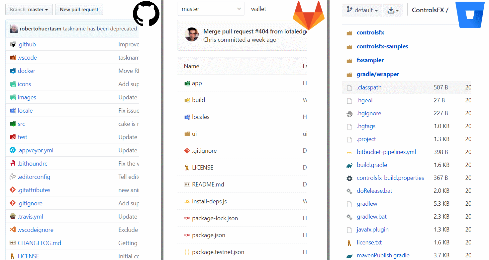

# GitHub vscode-icons (Updated)

Chrome webstore: 

**Download:**

**Supported websites:**
 Github (also Gist),
 Gitlab,
<!--  Bitbucket (WIP), -->
 Pastebin,
 SourceForge

## About

Extension for browser, which displays [vscode-icons](https://github.com/vscode-icons/vscode-icons) in Github (including Gist), Gitlab and Bitbucket repositories. It also displays `vscode-icons` in user's Pastebin list and in Sourceforge projects.

If you're familiar with beautiful extension for vscode called `vscode-icons`, then you know that you need also one for Web. Brain will recognize different icons much faster and when you're spending several hours per day on websites like github, gitlab or bitbucket, this extension is for you.
If you look at github repository with displayed `vscode-icons`, you'll get instant overview of used technologies by their specific icons (*look at screenshots below*).

Go to [changelog](./CHANGELOG.md) to see latest changes

## Screenshots

## Development

To stay updated with `vscode-icons`, you need to extract compiled `icons.json` from `vscode-icons` everytime when it updates.
After that, you need run script called `npm run preprocess`, which will generate definition chunks (categorized icons) from `icons.json` for easier and faster work with them.

## Related

- [vscode-icons](https://github.com/vscode-icons/vscode-icons) extension for vscode
- [vscode-icons-ts](https://github.com/zardoy/vscode-icons-ts) File specific icons from vscode [vscode-icons](https://github.com/vscode-icons/vscode-icons) extension inspired by file-icons-js
